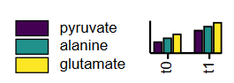

# MetaboMAPS

MetaboMAPS is a web project for manipulating metabolic pathways in SVG format. MetaboMAPS consists of two main parts: the *visualization tool*, where users can plot their own data set, and the *plot box editor*, where users can add or change the areas for visualization (plot boxes) and assign identifiers to them.

This is a frontend-only version of MetaboMAPS. The backend deals with data and user management and is not necessary for this single pathway example.

## Data visualization

The script `metabomaps.js` performs the data handling and visualization of the data. **Data** means basically every numerical data that are associated to pathway maps. This includes but is not limited to:

- transcriptome data
- proteome data
- metabolome data
- microarray data
- modeling data (e.g. flux distributions)
- 13C flux measurements
- ...

The only limitation is that the data must be in CSV format with the identifiers in the first column and numerical data in all following columns. Allowed CSV delimiters are comma, semicolon, pipes, and tabs.
The data should look like the example files `data/metabolome.csv` and `data/transcriptome.csv`:

```csv
metabolome,c1,c2,c3,c4,c5
Citrate,7,38,56,37,65
Isocitrate,2,33,37,17,96
2-oxoglutarate,72,71,56,78,26
succinyl-coa,7,79,,5,22
succinate,27,70,92,68,14
fumarate,96,46,0,75,78
...
```

As you can see, the first row contains a header that is used to generate legends by labeling them with each condition (here simplified as c1 to c5).

### Plot types

MetaboMAPS offers four different plot types that are drawn by respective functions from `metabomaps.js`.
The currently supported plot types are:

1. Heat maps:
   - `drawHeatmap();`
   - values are represented by colors
   - categorical color scales cannot applied
   - only one data set: squares or arrows/circles (if zero is defined)
   - more than five datasets: heat map is wrapped in two rows
   - empty values: box is not drawn
2. Bar charts:
   - `drawBarchart();`
   - three variants: normal, log10-scale, and grouped
   - values are represented by bar height
   - negative values cannot be processed
   - if max is defined and the value is higher than max, a double line on top of a bar indicates, that the ba is truncated
   - min and zero are currently ignored
   - always uses ordinal color scale to discriminate conditions
   - empty values: marked with *
3. Line charts:
   - `drawLinechart();`
   - values are represented by the y-intercept
   - always uses a color from the beginning of the color scale
   - min and zero are currently ignored
   - empty values: neither dot nor line is drawn
4. Pie charts:
   - `drawPiechart();`
   - values are represented by the area of each pie piece
   - negative values cannot be processed
   - always uses ordinal color scale to discriminate conditions
5. Circle indicators
   - `drawCircleHeatmap();`
   - values are represented by colors
   - categorical color scales cannot applied
   - more than seven datasets: heat map is wrapped in two rows
   - empty values: box is not drawn


#### Grouped bar charts

A grouped bar chart requires a special format of the header in the data set. The following [example](data/metabolome_group.csv) shows, how underscores are used to seperate the group from the condition:

    metabolome;t0_pyruvate;t0_alanine;t0_glutamate;t1_pyruvate;t1_alanine;t1_glutamate
    citrate;100;80;100;80;100;80
    fumarate;96;46;22;75;78;44
    ...

In this way, we retrieve two groups (t0 and t0) containing each three conditions (pyruvate, alanine, and glutamate). Conclusively, the legend shows, how the grouped bar chart will look like:




## The plot box editor

This tool gives the possibility to add and edit the plot boxes and assign identifiers. Most functionality is given in the `svg-editor.js` script. You can zoom into the pathway map by using the mouse wheel and navigate by drag and drop on the background.

**Plot boxes** and **identifiers** are the essentials of MetaboMAPS. A new plot box is added to the selected pathway maps by right click. The newly created box will have a red border, meaning that no identifiers are assigned yet. You can move all boxes by drag and drop and select them by left click. When a plot box is selected, you will see a form on the right side, where identifiers can be assigned. We distinguish between general identifiers that are organism-independant (e.g. EC numbers, metabolite names...; shown in grey) and organism-specific identifiers (e.g. locus tags, GIs...; shown in orange). You must define wheather the plot boxes belong to a metabolite or to a reaction. This has an impact on the suggestions you get, when typing. Metabolite boxes are marked with a dashed border. Once an identifier is assigned, the plot box border will turn green. You can remove selected plot boxes by clicking on the respective button.

When you type an identifier and press enter, it will be selected from the database or (when not found) marked as organism-dependant.
If you press Ctrl+Enter, you prevent database connection and mark the identifier as organism-dependant, even when an entry could be found in the database. This is useful when identifiers are not the same as found in the database.
If you press Alt+Enter, the identifier is marked as putative, meaning that you are not sure, if this identifier (e.g. a gene) really belongs to this plot box. This is useful to higlight unsureness for other users.

If the plot boxes are to small or to large for the pathway map, you can easily adjust the size of all boxes by clicking on + or -.


## Dependencies

MetaboMAPS uses [jQuery](https://jquery.com/) for interface bindings. Data visualization and SVG manipulation is performed by using the [D3.js library](https://d3js.org/). The used CSS framework is [Bootstrap](https://getbootstrap.com/).

